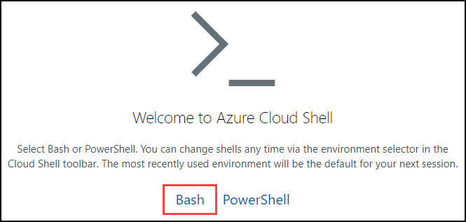
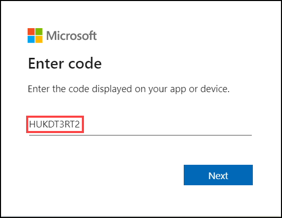
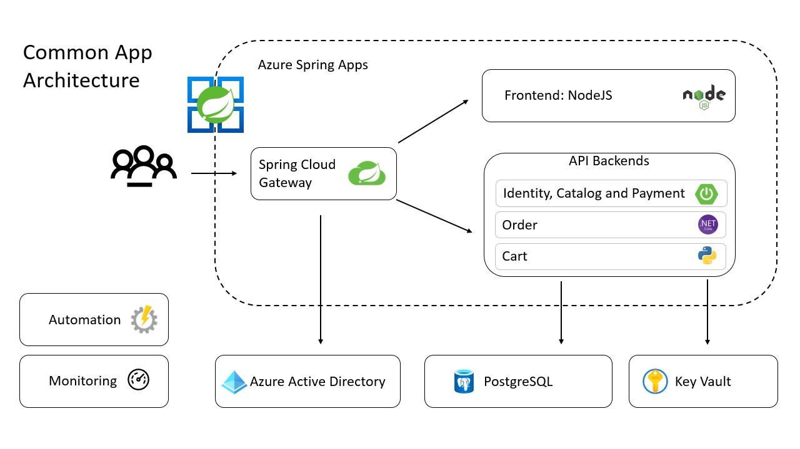
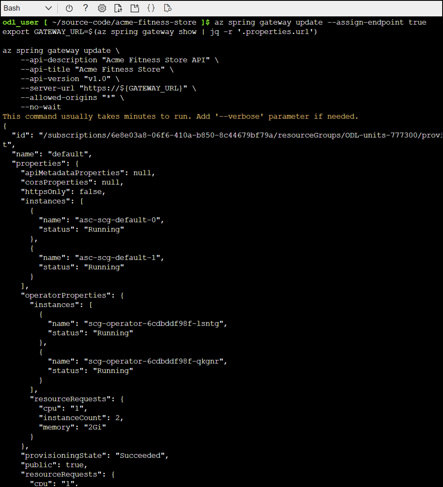
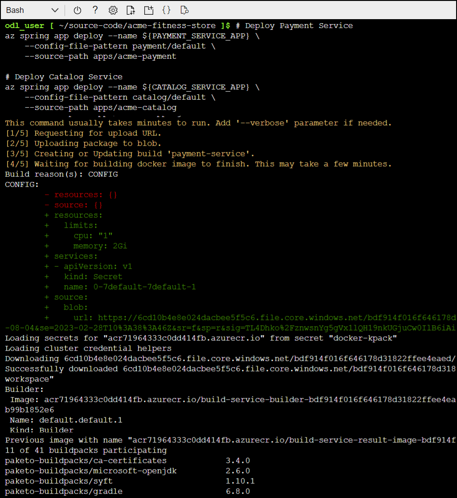
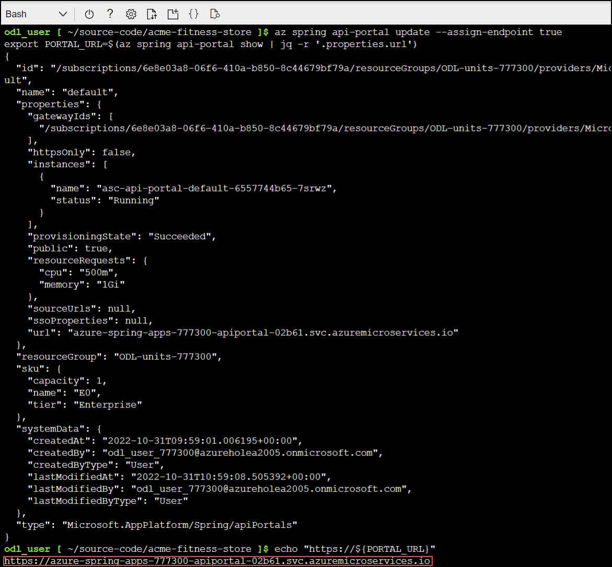

# Lab 1 :  Deploy and Build Applications

In this lab, you will learn how to build and deploy Spring applications to Azure Spring Apps.

### Task 1 : Prepare your environment for deployments

1. If you are not logged in already, click on Azure portal shortcut that is available on the desktop and log in with below Azure credentials.
    * Azure Username/Email: <inject key="AzureAdUserEmail"></inject> 
    * Azure Password: <inject key="AzureAdUserPassword"></inject>
    
1.  Click on the Cloud shell icon on the top right – > Next to the search bar.    

                               

1. Select on bash shell to launch. 

   

1. Under the you have no storage mounted pop-up, select **your subscription** (1) and then click on **Create storage** (2).

      

1. Once the cloud drive is created, cloud shell will be launched.

1. To make a copy of the supplied template, run the following command in the bash shell pane : 

    ```shell
    git clone https://github.com/CloudLabsAI-Azure/acme-fitness-store
    cp ./scripts/setup-env-variables-template.sh ./scripts/setup-env-variables.sh
    ```

1. To open the `./scripts/setup-env-variables.sh` file, run the following command :

   ```shell
   cd azure
   vim setup-env-variables.sh
   ```

1. Update the following variables in the setup-env-variables.sh file by replacing the following values :

   ```shell
   export SUBSCRIPTION=subscription-id                 # replace it with your subscription-id
   export RESOURCE_GROUP=resource-group-name           # existing resource group 
   export SPRING_APPS_SERVICE=azure-spring-apps-name   # name of the existing azure spring apps service 
   export LOG_ANALYTICS_WORKSPACE=log-analytics-name   # name of the existing log analytics workspace 
   export REGION=region-name                           # region should be same as the region of your azure spring apps service
   ```
   > **Note:** You can use the arrow keys to move around in the file. Press the "i" key to enter insert mode to make the required changes. After making the changes press the escape "ESC" key to exit insert mode and then type ":wq" to save and close the file.
  
   

1. Run the following command to move back to the acme-fitness-store directory and then set up the environment :
  
   ```shell
   cd ..
   source ./azure/setup-env-variables.sh
   ```   
  
1. Run the following command to login to the azure:

    ```shell
   az login
   ```   

1. After running the above command you will be prompted with the code to authenticate like the code which is shown in the image below.

   

1. Now open a browser and paste the link which you got after running the command "az login" and give the code to authenticate.

   

1. Run the following commands to get the list of subscriptions and also to set your subscription:

     ```shell
   az account list -o table
   az account set --subscription ${SUBSCRIPTION}
   ```     
   > **Note:** Replace ${SUBSCRIPTION} with the subscription Id which you can find in the Environment details page. 

   
   
1. Now, run the following command to set your default resource group name and cluster name :

    ```shell
    az configure --defaults \
    group=${RESOURCE_GROUP} \
    location=${REGION} \
    spring=${SPRING_APPS_SERVICE}
    ```
  
### Task 2 : Deploy a Hello World service to ASA-E 

In this task, you will try to deploy a very simple hello-world spring boot app to get a high level understanding of how to deploy an asa-e app and access it.

1. To invoke the Spring Initializer for creating the Spring Boot application, run the following command :

   ```shell
   curl https://start.spring.io/starter.tgz -d dependencies=web -d baseDir=hello-world \ -d bootVersion=2.7.5 -d javaVersion=17 -d type=maven-project | tar -xzvf -
   ```

1. Run the following command to create a new file called HelloController.java in the hello-world directory and adding the a new Spring MVC Controller inside that file.

   ```shell
   cd hello-world
   cat > HelloController.java << EOF
   package com.example.demo;

   import org.springframework.web.bind.annotation.GetMapping;
   import org.springframework.web.bind.annotation.RestController;

   @RestController
   public class HelloController {

      @GetMapping("/hello")
      public String hello() {
        return "Hello from Azure Spring Apps Enterprise";
    }
   }
   EOF
   mv HelloController.java src/main/java/com/example/demo/HelloController.java
   ```
1. Run the following command create the 'hello-world' app instance and deploy it to Azure Spring Apps Enterprise:

   ```shell
   az spring app create -n hello-world
   ./mvnw clean package
   az spring app deploy -n hello-world --artifact-path target/demo-0.0.1-SNAPSHOT.jar
   cd ..
   ```

1. Now navigate back to Azure portal and Look for your Azure Spring Apps instance in your resource group.

1. Click on "Apps" in the "Settings" section of the navigation pane and select "hello-world"

1. On the overview page, Find the "Test endpoint" in the "Essentials" section


### Task 3 : Introduction to Acme Fitness app 

This section discusses the demo application that you will be using in this lab to demonstrate the different features of ASA-E.

Below image shows the services involved in the ACME Fitness Store. It depicts the applications and their dependencies on different ASA-E services. We will be implementing this architecture by the end of this workshop.


This application is composed of several services:

* 3 Java Spring Boot applications:
  * A catalog service for fetching available products
  * A payment service for processing and approving payments for users' orders
  * An identity service for referencing the authenticated user

* 1 Python application:
  * A cart service for managing a users' items that have been selected for purchase

* 1 ASP.NET Core applications:
  * An order service for placing orders to buy products that are in the users' carts

* 1 NodeJS and static HTML Application
  * A frontend shopping application

### Task 4 : Bind to Application Configuration Service 
The Application configuration service is a feature of azure spring apps enterprise that makes Spring Apps config server capabilities available in a polyglot way.

1. Run the following command to bind the spring applications to the Application Configuration Service:
 
   ```shell
    az spring application-configuration-service bind --app ${PAYMENT_SERVICE_APP}
    az spring application-configuration-service bind --app ${CATALOG_SERVICE_APP}
   ```
    
      
    
 ### Task 5 : Bind to Service Registry 
 
 Applications need to communicate with each other. ASA-E internally uses Tanzu Service Registry for dynamic service discovery.
 
 1.  Run the following command to bind the spring applications to the Service Registry:

     ```shell
     az spring service-registry bind --app ${PAYMENT_SERVICE_APP}
     az spring service-registry bind --app ${CATALOG_SERVICE_APP}
     ```

     

### Task 6 : Configure Spring Cloud Gateway 

In this task, you will create a spring cloud gateway instance for acme-fitness and connect all the backend services to this gateway instance. This way the gateway instance acts as the proxy for any requests that are targeted towards the acme-fitness application.

1. To assign a public endpoint and update the Spring Cloud Gateway configuration with API information, run the following command:

   ```shell
   az spring gateway update --assign-endpoint true
   export GATEWAY_URL=$(az spring gateway show | jq -r '.properties.url')
    
   az spring gateway update \
      --api-description "Acme Fitness Store API" \
      --api-title "Acme Fitness Store" \
      --api-version "v1.0" \
      --server-url "https://${GATEWAY_URL}" \
      --allowed-origins "*" \
      --no-wait
    ```

    

1. Run the following command to create routing rules for the applications:

    ```shell
    az spring gateway route-config create \
      --name ${CART_SERVICE_APP} \
      --app-name ${CART_SERVICE_APP} \
      --routes-file ./routes/cart-service.json
    
    az spring gateway route-config create \
      --name ${ORDER_SERVICE_APP} \
      --app-name ${ORDER_SERVICE_APP} \
      --routes-file ./routes/order-service.json

   az spring gateway route-config create \
      --name ${CATALOG_SERVICE_APP} \
      --app-name ${CATALOG_SERVICE_APP} \
      --routes-file ./routes/catalog-service.json

   az spring gateway route-config create \
      --name ${FRONTEND_APP} \
      --app-name ${FRONTEND_APP} \
      --routes-file ./routes/frontend.json
   ```

   

### Task 7 : Build and Deploy Polyglot Applications 

 In this task, you will deploy the more sophisticated acme-fitness application to the same asa-e instance.
 
 1. Run the following command to deploy and build each application with its required parameters:

    ```shell
    # Deploy Payment Service
    az spring app deploy --name ${PAYMENT_SERVICE_APP} \
       --config-file-pattern payment/default \
       --source-path ./apps/acme-payment 

    # Deploy Catalog Service
    az spring app deploy --name ${CATALOG_SERVICE_APP} \
       --config-file-pattern catalog/default \
       --source-path ./apps/acme-catalog 

    # Deploy Order Service
    az spring app deploy --name ${ORDER_SERVICE_APP} \
       --source-path ./apps/acme-order 

    # Deploy Cart Service 
    az spring app deploy --name ${CART_SERVICE_APP} \
       --env "CART_PORT=8080" \
       --source-path ./apps/acme-cart 

    # Deploy Frontend App
    az spring app deploy --name ${FRONTEND_APP} \
       --source-path ./apps/acme-shopping 
    ```

    > **Note:** Deploying all applications will take approximately 5-10 minutes.

    

### Task 8 : Access the Application through Spring Cloud Gateway 

1. Run the following command and then open the output from the following command in a browser:

   ```shell
   echo "https://${GATEWAY_URL}"
   ```
   

1. Copy the gateway URL and paste it in a new browser and then you should see the ACME Fitness Store Application. Explore the application, but notice that not      everything is functioning yet. Continue on to Lab 2 to configure Single Sign On to enable the rest of the functionality ( features like log in, adding items to the cart, or completing an order).

   

### Task 9 : Explore the API using API Portal 

1. To assign an endpoint to API Portal, run the following command:

   ```shell 
   az spring api-portal update --assign-endpoint true
   export PORTAL_URL=$(az spring api-portal show | jq -r '.properties.url')
   ```

1. Run the following command and then open the output from the following command in a browser:

   ```shell
   echo "https://${PORTAL_URL}"
   ```
   
   
