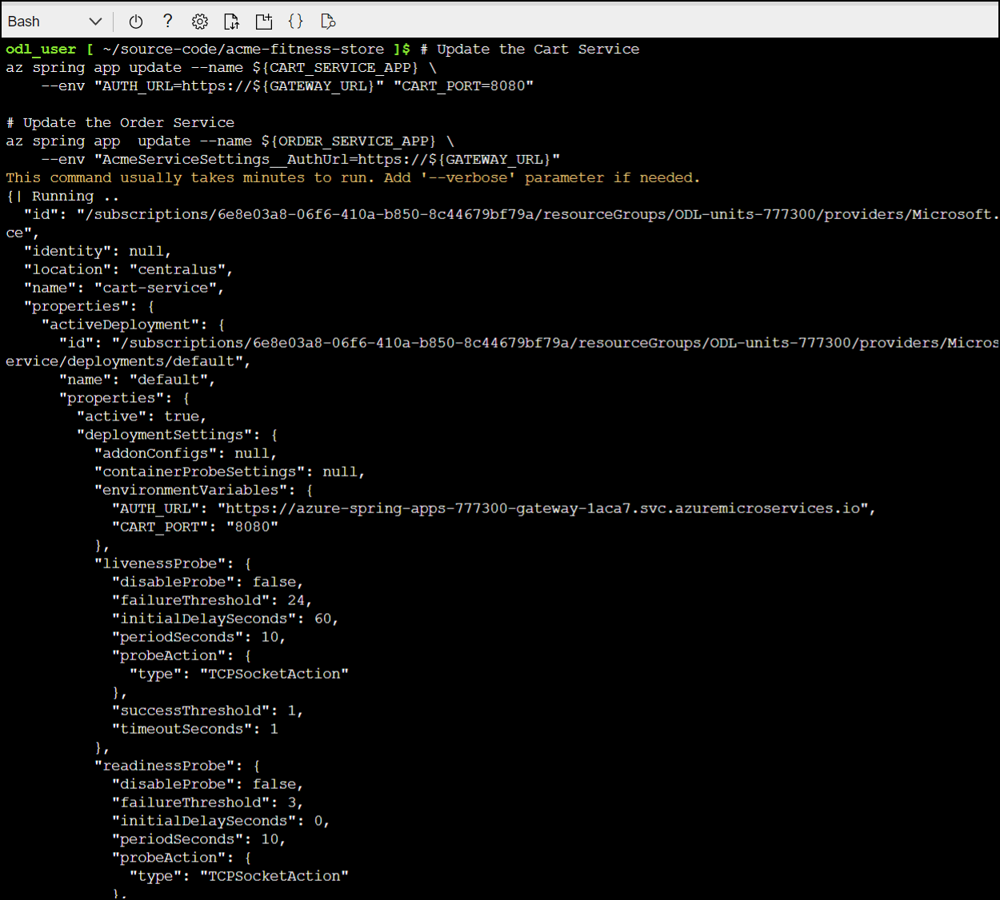

# Lab 2 : Configure Single Sign-On
 
In this lab, you will configure Single Sign-On for Spring Cloud Gateway using Azure Active Directory.
 
### Task 1 : Configure Spring Cloud Gateway with SSO  

1. Run the following command to configure Spring Cloud Gateway with SSO enabled:

   ```shell
   az spring gateway update \
       --client-id ${CLIENT_ID} \
       --client-secret ${CLIENT_SECRET} \
       --scope ${SCOPE} \
       --issuer-uri ${ISSUER_URI} \
       --no-wait
   ```   

   

### Task 2 : Update the Existing Applications 

1. Run the following command to update the existing applications to use authorization information from Spring Cloud Gateway:

   ```shell
   # Update the Cart Service
   az spring app update --name ${CART_SERVICE_APP} \
       --env "AUTH_URL=https://${GATEWAY_URL}" "CART_PORT=8080" 
    
   # Update the Order Service
   az spring app  update --name ${ORDER_SERVICE_APP} \
       --env "AcmeServiceSettings__AuthUrl=https://${GATEWAY_URL}" 
   ```
   


### Task 3 : Login to the Application through Spring Cloud Gateway 

1. Run the following command to retrieve the URL for Spring Cloud Gateway and then open the output in a browser:

   ```shell
   echo "https://${GATEWAY_URL}"
   ```
   
 
1. You should see the ACME Fitness Store Application, and then click on **Login** button.
   
   
1. Click on **Accept** inorder to able to log in using your SSO Credentials. 

   
   
1. Once logged in, the remaining functionality of the application will be available. This includes adding items to the cart and placing an order.

    

### Task 4 : Configure SSO for API Portal 

1. To configure API Portal with SSO enabled, run the following command:

   ```shell
   export PORTAL_URL=$(az spring api-portal show | jq -r '.properties.url')

   az spring api-portal update \
       --client-id ${CLIENT_ID} \
       --client-secret ${CLIENT_SECRET}\
       --scope "openid,profile,email" \
       --issuer-uri ${ISSUER_URI}
   ```

   

### Task 5 : Explore the API using API Portal 

1. Run the following command to retrieve the URL for API Portal and then open the output in a browser: 

   ```shell
   echo "https://${PORTAL_URL}"
   ```

   

   > Note : Now you will be able to log in using your SSO Credentials. To access the protected APIs, click Authorize and follow the steps that match your SSO provider.

   
