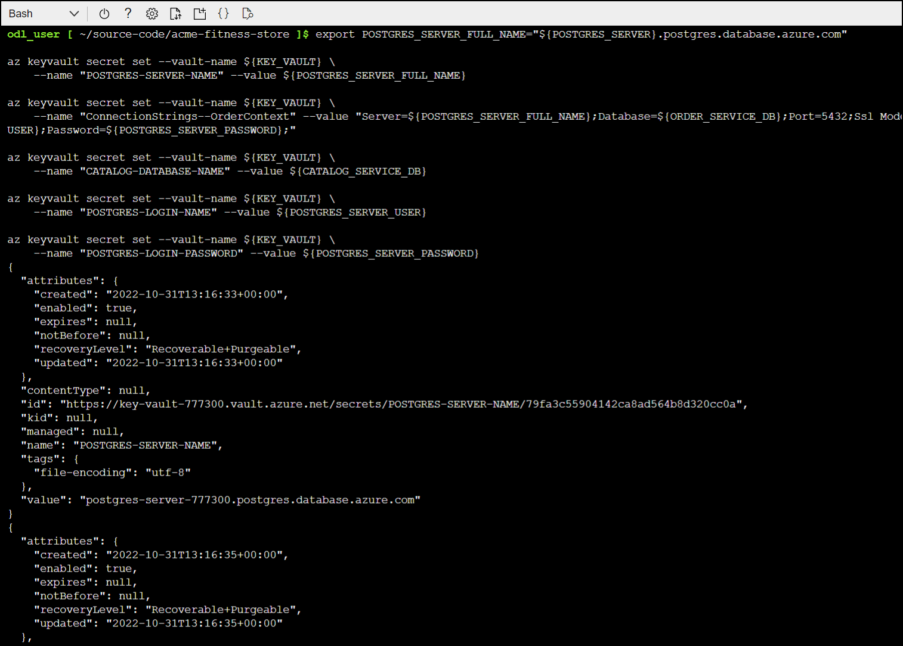
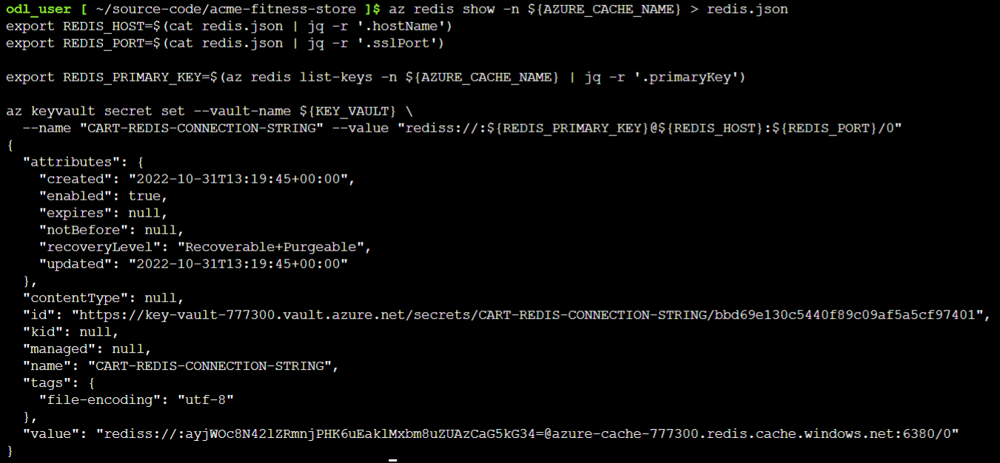
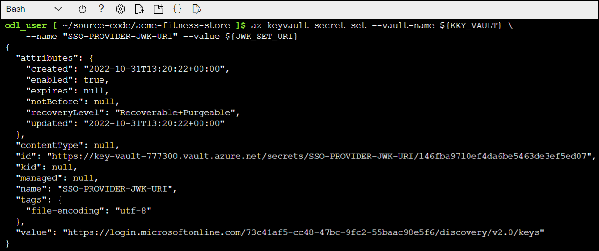

# Lab 4 : Securely Load Application Secrets

In this lab, you will use Azure Key Vault to securely store and load secrets to connect to Azure services.

### Task 1 : Store secrets

1.  Store database connection secrets in Key Vault.

      ```shell
      export POSTGRES_SERVER_FULL_NAME="${POSTGRES_SERVER}.postgres.database.azure.com"

      az keyvault secret set --vault-name ${KEY_VAULT} \
         --name "POSTGRES-SERVER-NAME" --value ${POSTGRES_SERVER_FULL_NAME}

      az keyvault secret set --vault-name ${KEY_VAULT} \
         --name "ConnectionStrings--OrderContext" --value "Server=${POSTGRES_SERVER_FULL_NAME};Database=${ORDER_SERVICE_DB};Port=5432;Ssl Mode=Require;User          Id=${POSTGRES_SERVER_USER};Password=${POSTGRES_SERVER_PASSWORD};"
    
      az keyvault secret set --vault-name ${KEY_VAULT} \
         --name "CATALOG-DATABASE-NAME" --value ${CATALOG_SERVICE_DB}
    
      az keyvault secret set --vault-name ${KEY_VAULT} \
         --name "POSTGRES-LOGIN-NAME" --value ${POSTGRES_SERVER_USER}
    
      az keyvault secret set --vault-name ${KEY_VAULT} \
         --name "POSTGRES-LOGIN-PASSWORD" --value ${POSTGRES_SERVER_PASSWORD}
         ```
      
   

1.  Retrieve and store redis connection secrets in Key Vault.

      ```shell
      az redis show -n ${AZURE_CACHE_NAME} > redis.json
      export REDIS_HOST=$(cat redis.json | jq -r '.hostName')
      export REDIS_PORT=$(cat redis.json | jq -r '.sslPort')

      export REDIS_PRIMARY_KEY=$(az redis list-keys -n ${AZURE_CACHE_NAME} | jq -r '.primaryKey')

      az keyvault secret set --vault-name ${KEY_VAULT} \
      --name "CART-REDIS-CONNECTION-STRING" --value "rediss://:${REDIS_PRIMARY_KEY}@${REDIS_HOST}:${REDIS_PORT}/0"
      ```

   

1.  Store SSO Secrets in Key Vault.

      ```shell
      az keyvault secret set --vault-name ${KEY_VAULT} \
         --name "SSO-PROVIDER-JWK-URI" --value ${JWK_SET_URI}
      ```

      > Note: Creating the SSO-PROVIDER-JWK-URI Secret can be skipped if not configuring Single Sign On

   

1.  Enable System Assigned Identities for applications and export identities to environment.

      ```shell
      az spring app identity assign --name ${CART_SERVICE_APP}
      export CART_SERVICE_APP_IDENTITY=$(az spring app show --name ${CART_SERVICE_APP} | jq -r '.identity.principalId')

      az spring app identity assign --name ${ORDER_SERVICE_APP}
      export ORDER_SERVICE_APP_IDENTITY=$(az spring app show --name ${ORDER_SERVICE_APP} | jq -r '.identity.principalId')

      az spring app identity assign --name ${CATALOG_SERVICE_APP}
      export CATALOG_SERVICE_APP_IDENTITY=$(az spring app show --name ${CATALOG_SERVICE_APP} | jq -r '.identity.principalId')

      az spring app identity assign --name ${IDENTITY_SERVICE_APP}
      export IDENTITY_SERVICE_APP_IDENTITY=$(az spring app show --name ${IDENTITY_SERVICE_APP} | jq -r '.identity.principalId')
      ```

1.  Add an access policy to Azure Key Vault to allow Managed Identities to read secrets.

      ```shell
      az keyvault set-policy --name ${KEY_VAULT} \
         --object-id ${CART_SERVICE_APP_IDENTITY} --secret-permissions get list
    
      az keyvault set-policy --name ${KEY_VAULT} \
         --object-id ${ORDER_SERVICE_APP_IDENTITY} --secret-permissions get list

      az keyvault set-policy --name ${KEY_VAULT} \
         --object-id ${CATALOG_SERVICE_APP_IDENTITY} --secret-permissions get list

      az keyvault set-policy --name ${KEY_VAULT} \
         --object-id ${IDENTITY_SERVICE_APP_IDENTITY} --secret-permissions get list
      ```

      > Note: Identity Service will not exist if you haven't completed Unit 2. Skip configuring an identity or policy for this service if not configuring Single Sign-On at this point.    

### Task 2 : Activate applications to load secrets from Azure Key Vault

1. If you are not logged in already, click on Azure portal shortcut that is available on the desktop and log in with below Azure credentials.
    * Azure Username/Email: <inject key="AzureAdUserEmail"></inject> 
    * Azure Password: <inject key="AzureAdUserPassword"></inject>
    
1.  Click on the Cloud shell icon on the top right – > Next to the search bar.    

1. Select on bash shell to launch.

1. Select the subscription and storage account. If you do not have existing storage account , you need to create a one.

1. Once the cloud drive is created, cloud shell will be launched.

1. To delete Service Connectors and activate applications to load secrets from Azure Key Vault, run the following command in the bash shell pane.

      ```shell
      az spring connection delete \
          --resource-group ${RESOURCE_GROUP} \
         --service ${SPRING_APPS_SERVICE} \
         --connection ${ORDER_SERVICE_DB_CONNECTION} \
         --app ${ORDER_SERVICE_APP} \
         --deployment default \
         --yes 

      az spring connection delete \
         --resource-group ${RESOURCE_GROUP} \
         --service ${SPRING_APPS_SERVICE} \
         --connection ${CATALOG_SERVICE_DB_CONNECTION} \
         --app ${CATALOG_SERVICE_APP} \
         --deployment default \
         --yes 

      az spring connection delete \
         --resource-group ${RESOURCE_GROUP} \
         --service ${SPRING_APPS_SERVICE} \
         --connection ${CART_SERVICE_CACHE_CONNECTION} \
         --app ${CART_SERVICE_APP} \
         --deployment default \
         --yes 
    
      az spring app update --name ${ORDER_SERVICE_APP} \
         --env "ConnectionStrings__KeyVaultUri=${KEYVAULT_URI}" "AcmeServiceSettings__AuthUrl=https://${GATEWAY_URL}" "DatabaseProvider=Postgres"

      az spring app update --name ${CATALOG_SERVICE_APP} \
         --config-file-pattern catalog/default,catalog/key-vault \
         --env "SPRING_CLOUD_AZURE_KEYVAULT_SECRET_PROPERTY_SOURCES_0_ENDPOINT=${KEYVAULT_URI}"             "SPRING_CLOUD_AZURE_KEYVAULT_SECRET_PROPERTY_SOURCES_0_NAME='acme-fitness-store-vault'" "SPRING_PROFILES_ACTIVE=default,key-vault"
    
      az spring app update --name ${IDENTITY_SERVICE_APP} \
         --config-file-pattern identity/default,identity/key-vault \
         --env "SPRING_CLOUD_AZURE_KEYVAULT_SECRET_PROPERTY_SOURCES_0_ENDPOINT=${KEYVAULT_URI}"       "SPRING_CLOUD_AZURE_KEYVAULT_SECRET_PROPERTY_SOURCES_0_NAME='acme-fitness-store-vault'" "SPRING_PROFILES_ACTIVE=default,key-vault"
    
      az spring app update --name ${CART_SERVICE_APP} \
         --env "CART_PORT=8080" "KEYVAULT_URI=${KEYVAULT_URI}" "AUTH_URL=https://${GATEWAY_URL}"
      ```
