# Lab 5 :  Monitor End-to-End

In this unit you will explore live application metrics and query logs to know the health of your applications.

### Task 1 : Add Instrumentation Key to Key Vault

1. If you are not logged in already, click on Azure portal shortcut that is available on the desktop and log in with below Azure credentials.
    * Azure Username/Email: <inject key="AzureAdUserEmail"></inject> 
    * Azure Password: <inject key="AzureAdUserPassword"></inject>
    
1.  Click on the Cloud shell icon on the top right – > Next to the search bar.    

1. Select on bash shell to launch.

1. Select the subscription and storage account. If you do not have existing storage account , you need to create a one.

1. Once the cloud drive is created, cloud shell will be launched.

1. The Application Insights Instrumentation Key must be provided for the non-java applications.

   > Note: In future iterations, the buildpacks for non-java applications will support
   > Application Insights binding and this step will be unnecessary.

1. To retrieve the Instrumentation Key for Application Insights and add to Key Vault, run the following command in the bash shell pane. (Replace ${APPLICATION_INSIGHTS} with your azure-spring-apps-<inject key="DeploymentID" enableCopy="false" />.)

   ```shell
      export INSTRUMENTATION_KEY=$(az monitor app-insights component show --app ${APPLICATION_INSIGHTS} | jq -r '.connectionString')

      az keyvault secret set --vault-name ${KEY_VAULT} \
       --name "ApplicationInsights--ConnectionString" --value ${INSTRUMENTATION_KEY}
   ```
   

### Task 2 : Update Sampling Rate

1. To Increase the sampling rate for the Application Insights binding, run the following command in the bash shell pane.

   ```shell
   az spring build-service builder buildpack-binding set \
      --builder-name default \
      --name default \
      --type ApplicationInsights \
      --properties sampling-rate=100 connection_string=${INSTRUMENTATION_KEY}
   ```

### Task 3 : Reload Applications

1. Run the following command to restart applications to reload configuration. For the Java applications, this will allow the new sampling rate to take effect. For the non-java applications, this will allow them to access the Instrumentation Key from Key Vault.

   ```shell
   az spring app restart -n ${CART_SERVICE_APP}
   az spring app restart -n ${ORDER_SERVICE_APP}
   az spring app restart -n ${IDENTITY_SERVICE_APP}
   az spring app restart -n ${CATALOG_SERVICE_APP}
   az spring app restart -n ${PAYMENT_SERVICE_APP}
   ```

   

### Task 4 : Get the log stream for an Application

1. Run the following command to get the latest 100 lines of app console logs from the Catalog Service.

   ```shell
   az spring app logs \
      -n ${CATALOG_SERVICE_APP} \
      --lines 100
   ```

   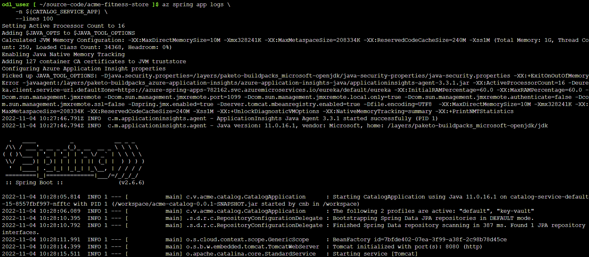

1. Run the following command by adding the `-f` parameter, so that you can get real-time log streaming from an app. Try log streaming for the Catalog Service.

   ```shell
   az spring app logs \
      -n ${CATALOG_SERVICE_APP} \
      -f
   ```

   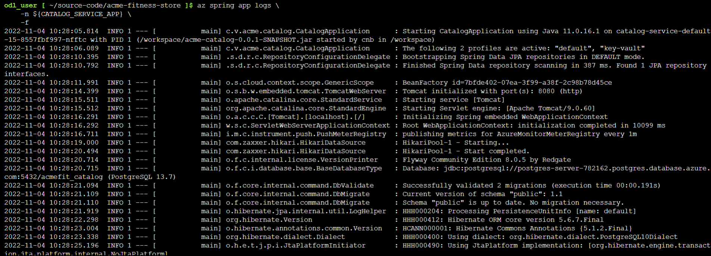

You can use `az spring app logs -h` to explore more parameters and log stream functionalities.

### Task 5 : Generate Traffic

In this task, you will use the ACME Fitness Shop Application to generate some traffic. Move throughout the application, view the catalog, or place an order.

1. To continuously generate traffic, use the traffic generator by running the following command:

   ```shell
   cd traffic-generator
   GATEWAY_URL=https://${GATEWAY_URL} ./gradlew gatlingRun-com.vmware.acme.simulation.GuestSimulation
   cd -
   ```

   

> **Note:** Continue on to the next tasks while the traffic generator runs. 

### Task 6 : Start monitoring apps and dependencies - in Application Insights

1. Move back to the azure portal and in the **search resources, services and docs bar**, type **Application insight** and select it from suggestions, as shown below: 

   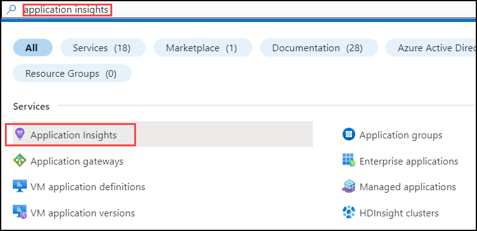  

1. Under the Application Insight page, select **azure-spring-apps-<inject key="DeploymentID" enableCopy="false" />**.
  
   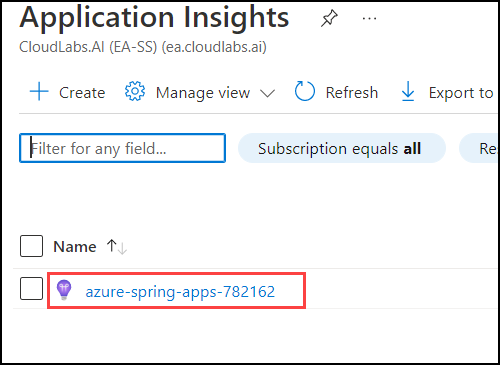

1. From the left panel, navigate to the `Application Map` blade under Investigate and then select time filter as **Last 4 hours**.

   
   
1. From the left panel, navigate to the `Peforamnce` blade under Investigate and then click on **Operations**:

   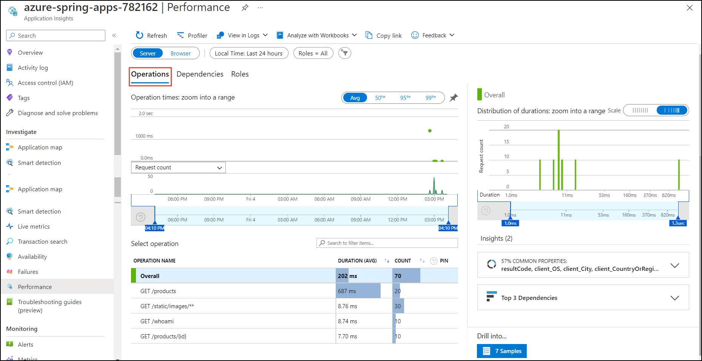

1. Now navigate to the `Performance/Dependenices` blade - you can see the performance number for dependencies, particularly SQL calls:

   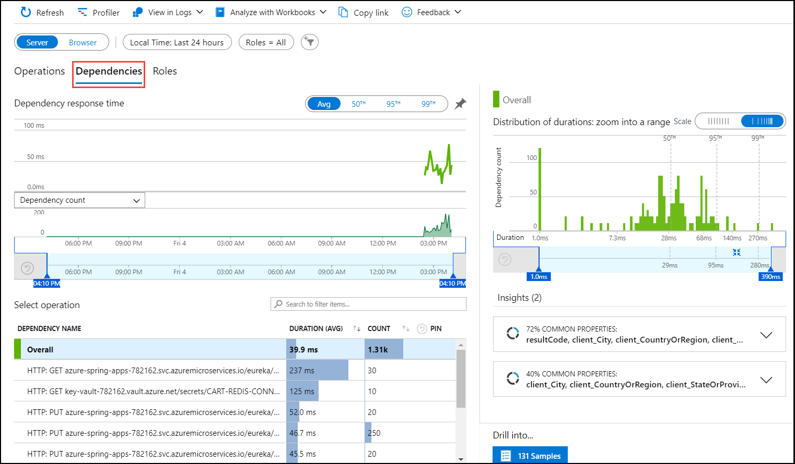

1. Navigate to the `Performance/Roles` blade - you can see the performance metrics for individual instances or roles:

   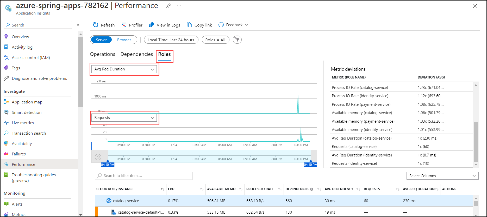
      
   
1. Now from the left panel, navigate to the `Failures` blade under Investigate and then select on `Exceptions` panel - you can see a collection of exceptions:

   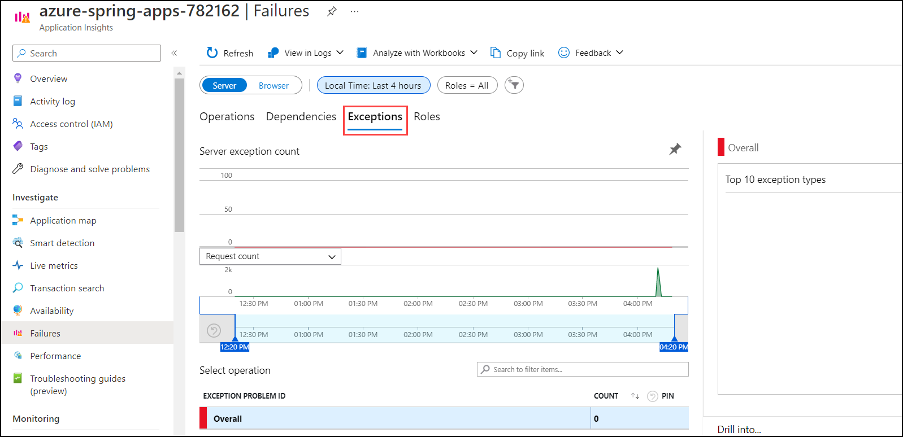
   
1. Now from the left panel, navigate to the `Metrics` blade under Monitoring - you can see metrics contributed by Spring Boot apps, Spring Cloud modules, and dependencies. The chart below shows `http_server_requests` and `Heap Memory Used`.

   

   

   > **Note:**  Spring Boot registers a lot number of core metrics: JVM, CPU, Tomcat, Logback...The Spring Boot auto-configuration enables the instrumentation of requests       handled by Spring MVC. The REST controllers `ProductController`, and `PaymentController` have been instrumented by the `@Timed` Micrometer annotation at class         level.

   * `acme-catalog` application has the following custom metrics enabled:
   * @Timed: `store.products`
   * `acem-payment` application has the following custom metrics enabled:
   * @Timed: `store.payment`

1. You can see these custom metrics in the `Metrics` blade:

   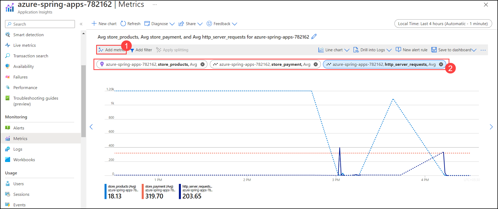
   
1. Now from the left panel, navigate to the `Live Metrics` blade under Investigate - you can see live metrics on screen with low latencies < 1 second:

   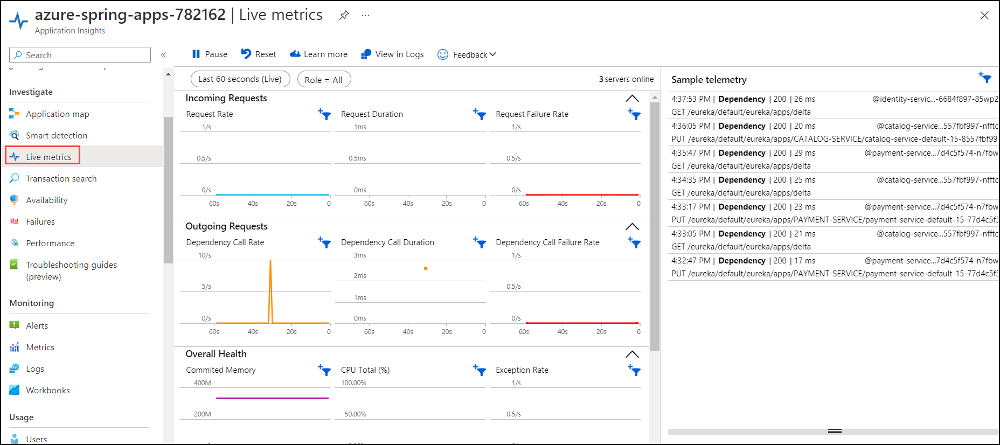

### Task 7 : Start monitoring ACME Fitness Store's logs and metrics in Azure Log Analytics

1. In the **search resources, services and docs bar**, type **Log analytics workspace** and select it from suggestions, as shown below: 

   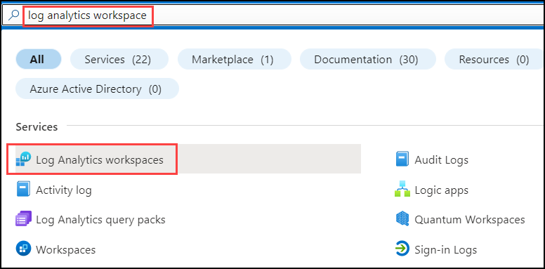

1. Under Log Analytics Workspaces page, select **log-analytics-<inject key="DeploymentID" enableCopy="false" />**.
   
   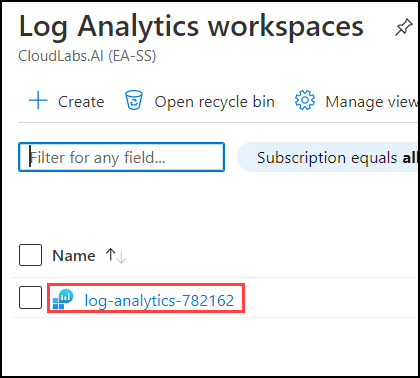

1. In the Log Analytics page, selects `Logs` blade (1) under General and paste the below Kusto query (2) and the click on **Run** (3) to see the application logs:

   ```sql
      AppPlatformLogsforSpring 
      | where TimeGenerated > ago(24h) 
      | limit 500
      | sort by TimeGenerated
      | project TimeGenerated, AppName, Log
   ```

   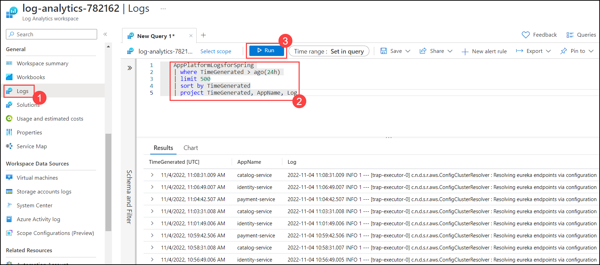

1. Now paste the below Kusto query (1) and the click on **Run** (2) to see `catalog-service` application logs:

   ```sql
      AppPlatformLogsforSpring 
      | where AppName has "catalog-service"
      | limit 500
      | sort by TimeGenerated
      | project TimeGenerated, AppName, Log
   ```
   
   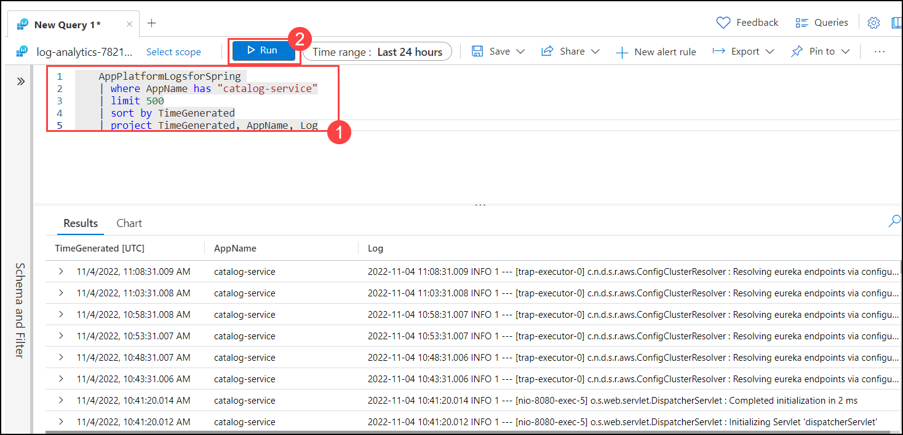

1. Now paste the below Kusto query (1) and the click on **Run** (2) to see errors and exceptions thrown by each app:
  
   ```sql
      AppPlatformLogsforSpring 
      | where Log contains "error" or Log contains "exception"
      | extend FullAppName = strcat(ServiceName, "/", AppName)
      | summarize count_per_app = count() by FullAppName, ServiceName, AppName, _ResourceId
      | sort by count_per_app desc 
      | render piechart
   ```

   

1. Now paste the below Kusto query (1) and the click on **Run** (2) to see all in the inbound calls into Azure Spring Apps:

   ```sql
      AppPlatformIngressLogs
      | project TimeGenerated, RemoteAddr, Host, Request, Status, BodyBytesSent, RequestTime, ReqId, RequestHeaders
      | sort by TimeGenerated
   ```
   
   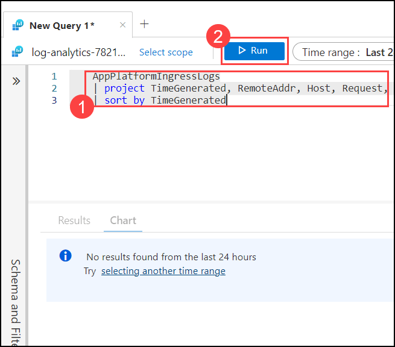

1. Now paste the below Kusto query (1) and the click on **Run** (2) to see all the logs from Spring Cloud Gateway managed by Azure Spring Apps:

   ```sql
      AppPlatformSystemLogs
      | where LogType contains "SpringCloudGateway"
      | project TimeGenerated,Log
   ```

   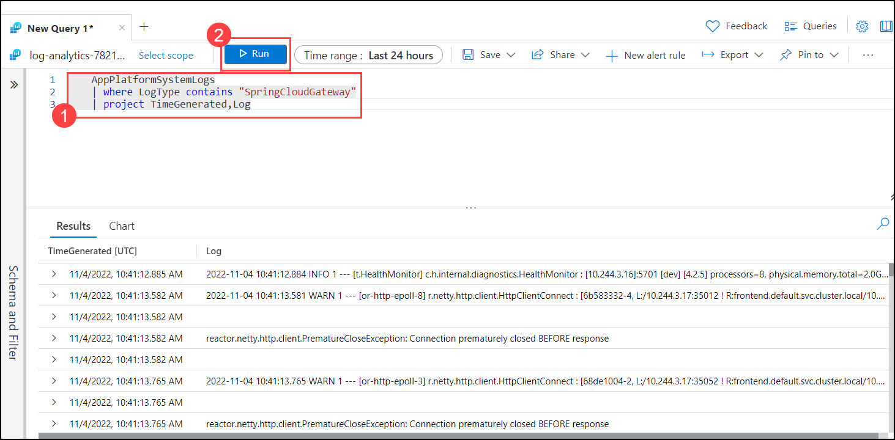

1. Now paste the below Kusto query (1) and the click on **Run** (2) to see all the logs from Spring Cloud Service Registry managed by Azure Spring Apps:

   ```sql
      AppPlatformSystemLogs
      | where LogType contains "ServiceRegistry"
      | project TimeGenerated, Log
   ```

   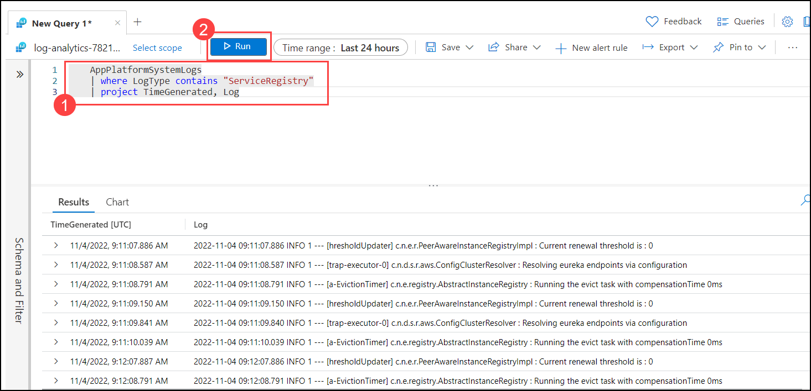

