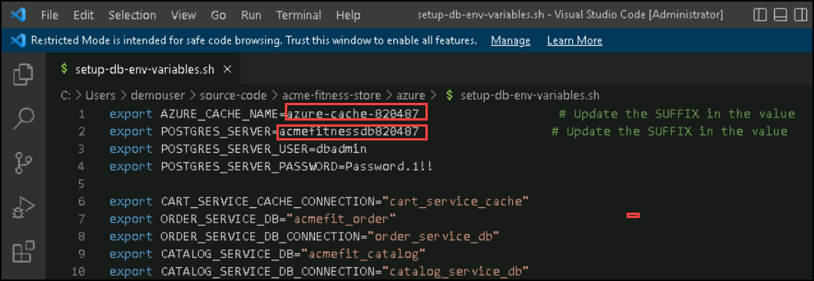
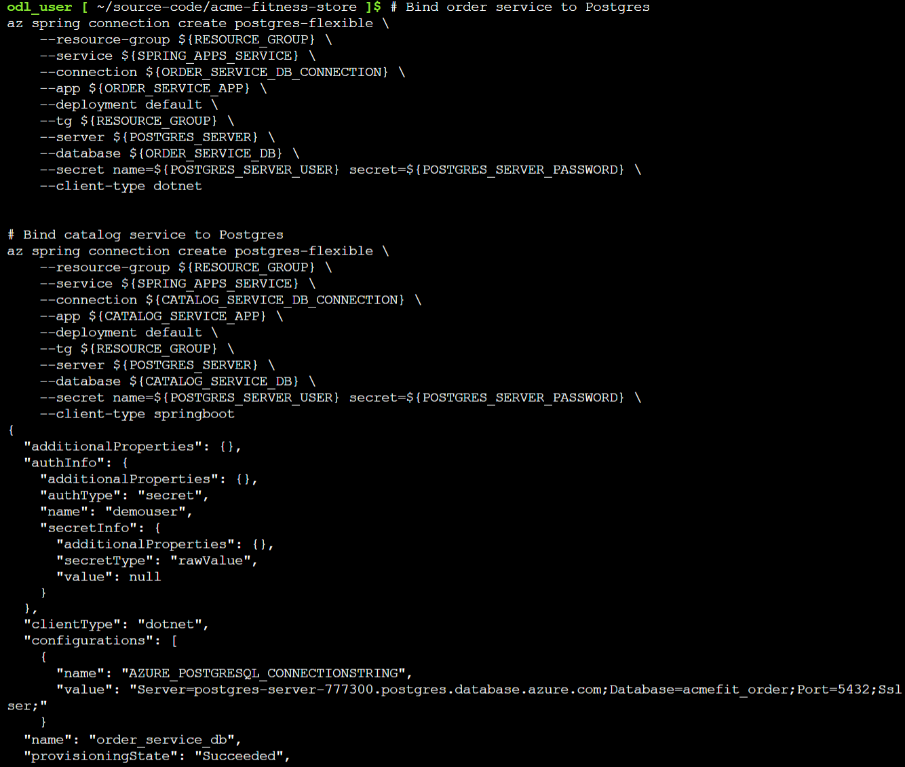
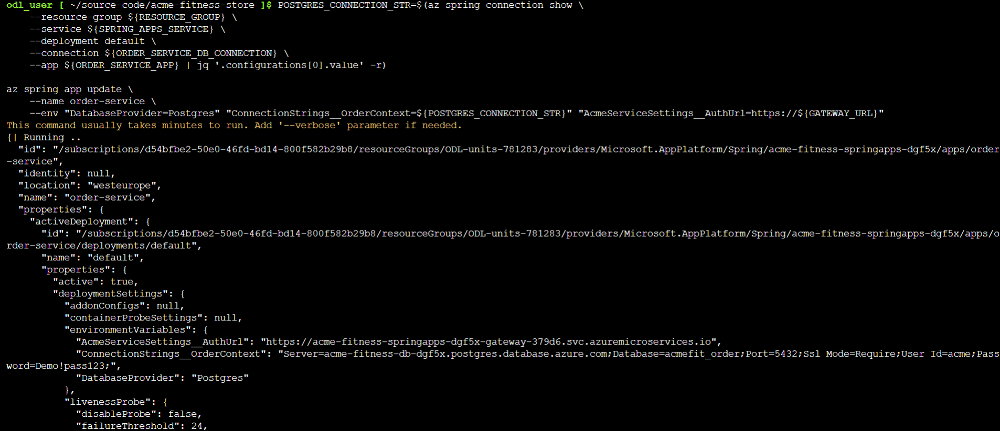
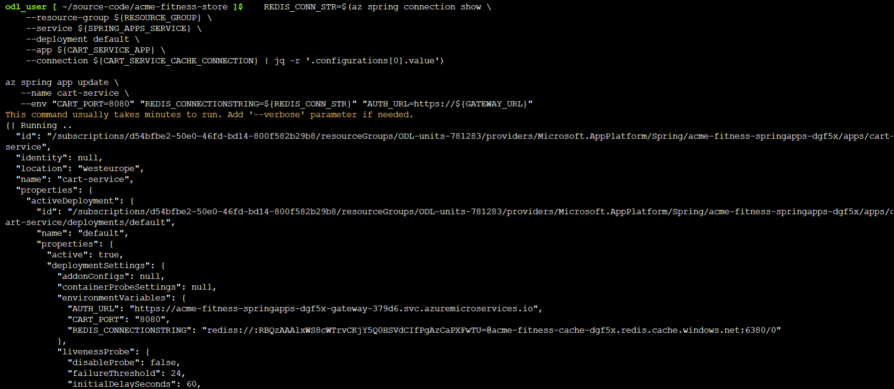

## Lab 3: Integrate with Azure Database for PostgreSQL and Azure Cache for Redis

Duration: 20 minutes

In this lab, you will create persistent stores outside the applications and connect those applications to those stores.

### Task 1: Prepare your environment 

1. Run the following bash command to make a copy of the supplied template:

   ```shell
    cp ./azure/setup-db-env-variables-template.sh ./azure/setup-db-env-variables.sh
   ```
   
1. To open the `setup-db-env-variables.sh` file, run the following command:

   ```shell
   cd azure
   code setup-db-env-variables.sh
   ```

1. Update the following variables in the setup-db-env-variables.sh file by replacing the SUFFIX value with **<inject key="DeploymentID" enableCopy="true" /> </inject>** and **Save** it using **Ctrl+S** key and then **Close** the file:

   ```shell
   export AZURE_CACHE_NAME=azure-cache-SUFFIX                   # Update the SUFFIX in the value
   export POSTGRES_SERVER=acmefitnessdbSUFFIX                  # Update the SUFFIX in the value
   ```
   
   
   
   
1. Run the following command to move back to the acme-fitness-store directory and then set up the environment:
  
   ```shell
   cd ..
   source ./azure/setup-db-env-variables.sh
   ```
   
### Task 2: Create Service Connectors
   
 1. The Order Service and Catalog Service use Azure Database for Postgres; therefore, run the following command to create Service Connectors for those applications:

      ```shell
      # Bind order service to Postgres
      az spring connection create postgres-flexible \
         --resource-group ${RESOURCE_GROUP} \
         --service ${SPRING_APPS_SERVICE} \
         --connection ${ORDER_SERVICE_DB_CONNECTION} \
         --app ${ORDER_SERVICE_APP} \
         --deployment default \
         --tg ${RESOURCE_GROUP} \
         --server ${POSTGRES_SERVER} \
         --database ${ORDER_SERVICE_DB} \
         --secret name=${POSTGRES_SERVER_USER} secret=${POSTGRES_SERVER_PASSWORD} \
         --client-type dotnet
    

      # Bind catalog service to Postgres
      az spring connection create postgres-flexible \
         --resource-group ${RESOURCE_GROUP} \
         --service ${SPRING_APPS_SERVICE} \
         --connection ${CATALOG_SERVICE_DB_CONNECTION} \
         --app ${CATALOG_SERVICE_APP} \
         --deployment default \
         --tg ${RESOURCE_GROUP} \
         --server ${POSTGRES_SERVER} \
         --database ${CATALOG_SERVICE_DB} \
         --secret name=${POSTGRES_SERVER_USER} secret=${POSTGRES_SERVER_PASSWORD} \
         --client-type springboot
      ```
 
      
 
 1. To connect Cart Service to Azure Cache for Redis, use the following command to create a service connector:
    
     >**Note:** You can ignore any warning related to auth. 

      ```shell
      az spring connection create redis \
         --resource-group ${RESOURCE_GROUP} \
         --service ${SPRING_APPS_SERVICE} \
         --connection $CART_SERVICE_CACHE_CONNECTION \
         --app ${CART_SERVICE_APP} \
         --deployment default \
         --tg ${RESOURCE_GROUP} \
         --server ${AZURE_CACHE_NAME} \
         --database 0 \
         --client-type java 
      ```

      

### Task 3: Update Applications

In this task, you will update the affected applications to use the databases and redis cache.

> **Note:** The commands listed in this task can run for up to two minutes. Hold off until the commands have been completed.

1. Run the following command to restart the Catalog service for the Service Connector to take effect:

   ```shell
    az spring app restart --name ${CATALOG_SERVICE_APP}
   ```
  
    
    
1. To retrieve the PostgreSQL connection string and update the Catalog service, run the following command:

   ```shell
    POSTGRES_CONNECTION_STR=$(az spring connection show \
      --resource-group ${RESOURCE_GROUP} \
      --service ${SPRING_APPS_SERVICE} \
      --deployment default \
      --connection ${ORDER_SERVICE_DB_CONNECTION} \
      --app ${ORDER_SERVICE_APP} | jq '.configurations[0].value' -r)

   az spring app update \
      --name order-service \
      --env "DatabaseProvider=Postgres" "ConnectionStrings__OrderContext=${POSTGRES_CONNECTION_STR}" "AcmeServiceSettings__AuthUrl=https://${GATEWAY_URL}"
   ```
   
   
   
1. To retrieve the Redis connection string and update the Cart Service, run the following command:   

   ```shell
      REDIS_CONN_STR=$(az spring connection show \
       --resource-group ${RESOURCE_GROUP} \
       --service ${SPRING_APPS_SERVICE} \
       --deployment default \
       --app ${CART_SERVICE_APP} \
       --connection ${CART_SERVICE_CACHE_CONNECTION} | jq -r '.configurations[0].value')

   az spring app update \
      --name cart-service \
      --env "CART_PORT=8080" "REDIS_CONNECTIONSTRING=${REDIS_CONN_STR}" "AUTH_URL=https://${GATEWAY_URL}"
   ```
  
    
  
### Task 4: View the persisted data 

1. By adding a few items to your cart, you can confirm that cart data is now persisted in Redis. Then, restart the cart service by running the following command:

   ```shell
   az spring app restart --name ${CART_SERVICE_APP}
   ``` 

   

   > **Note:** You'll notice that after restarting the cart service, the items in your cart will now persist.

3.  Browse the URL `https://${GATEWAY_URL}/order/${USER_ID}` in your browser and you will be able to see the following output:
      > **Note:** Replace ${USER_ID} with ODL_User <inject key="DeploymentID" enableCopy="false" /> respectively in the above command.


     

4. Run the following command to restart the order service application:

   ```shell
   az spring app restart --name ${ORDER_SERVICE_APP}
   ```
   
   > **Note:** After restarting, revisit the URL for your placed orders and notice that they persisted. 

   > **Note:** After finishing the exercise, be sure not to close the Git Bash window.

Now, click on **Next** in the lab guide section in the bottom right corner to jump to the next exercise instructions.
