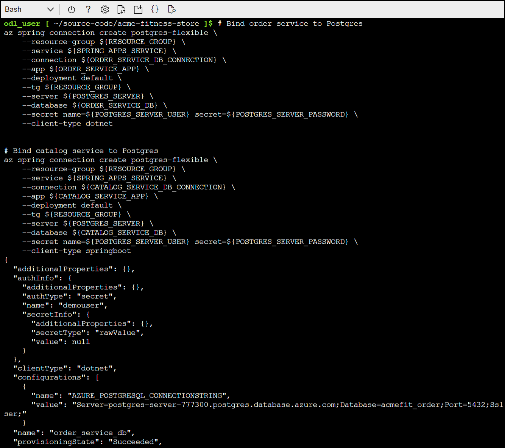
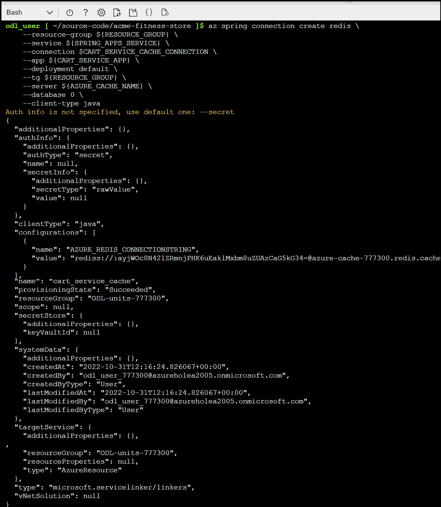
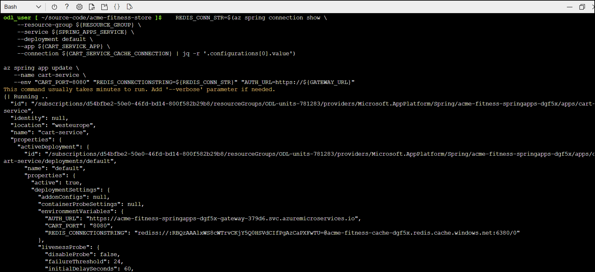

## Lab 3: Integrate with Azure Database for PostgreSQL and Azure Cache for Redis

In this lab, you will create persistent stores outside the applications and connect applications to those stores.

### Task 1: Prepare your environment 

1. Run the following bash command to make a copy of the supplied template:

   ```shell
    cp ./azure/setup-db-env-variables-template.sh ./azure/setup-db-env-variables.sh
   ```
   
1. To open `setup-db-env-variables.sh` file, run the following command :

   ```shell
   cd azure
   vim setup-db-env-variables.sh
   ```

1. Update the following variables in the setup-db-env-variables.sh file by replacing the following values :

   ```shell
   export AZURE_CACHE_NAME=acme-fitness-cache-CHANGE-ME                 #Replace CHANGE_ME with the name of your azure cache for redis instance
   export POSTGRES_SERVER=acme-fitness-db-CHANGE-ME                     #Replace CHANGE_ME with the name of your postgres server
   ```
   
   
   
   > **Note:** You can use the arrow keys to move around in the file. Press the "i" key to enter insert mode to make the required changes. After making the changes press the escape "ESC" key to exit insert mode and then type ":wq" to save and close the file.

1. Run the following command to move back to the acme-fitness-store directory and then set up the environment :
  
   ```shell
   cd ..
   source ./azure/setup-db-env-variables.sh
   ```
   
### Task 2: Create Service Connectors
   
 1. The Order Service and Catalog Service use Azure Database for Postgres, therefore run the following command to create Service Connectors for those applications:

      ```shell
      # Bind order service to Postgres
      az spring connection create postgres-flexible \
         --resource-group ${RESOURCE_GROUP} \
         --service ${SPRING_APPS_SERVICE} \
         --connection ${ORDER_SERVICE_DB_CONNECTION} \
         --app ${ORDER_SERVICE_APP} \
         --deployment default \
         --tg ${RESOURCE_GROUP} \
         --server ${POSTGRES_SERVER} \
         --database ${ORDER_SERVICE_DB} \
         --secret name=${POSTGRES_SERVER_USER} secret=${POSTGRES_SERVER_PASSWORD} \
         --client-type dotnet
    

      # Bind catalog service to Postgres
      az spring connection create postgres-flexible \
         --resource-group ${RESOURCE_GROUP} \
         --service ${SPRING_APPS_SERVICE} \
         --connection ${CATALOG_SERVICE_DB_CONNECTION} \
         --app ${CATALOG_SERVICE_APP} \
         --deployment default \
         --tg ${RESOURCE_GROUP} \
         --server ${POSTGRES_SERVER} \
         --database ${CATALOG_SERVICE_DB} \
         --secret name=${POSTGRES_SERVER_USER} secret=${POSTGRES_SERVER_PASSWORD} \
         --client-type springboot
      ```
 
      
 
 1. Run the following command to create a service connector for Cart Service to connect it to Azure Cache for Redis:

      ```shell
      az spring connection create redis \
         --resource-group ${RESOURCE_GROUP} \
         --service ${SPRING_APPS_SERVICE} \
         --connection $CART_SERVICE_CACHE_CONNECTION \
         --app ${CART_SERVICE_APP} \
         --deployment default \
         --tg ${RESOURCE_GROUP} \
         --server ${AZURE_CACHE_NAME} \
         --database 0 \
         --client-type java 
      ```

      

### Task 3: Update Applications

In this task, you update the affected applications to use the databases and redis cache.

1. Run the following command to restart the Catalog Service for the Service Connector to take effect:

   ```shell
    az spring app restart --name ${CATALOG_SERVICE_APP}
   ```
  
    
    
1. To retrieve the PostgreSQL connection string and update the Catalog Service, run the following command:

   ```shell
    POSTGRES_CONNECTION_STR=$(az spring connection show \
      --resource-group ${RESOURCE_GROUP} \
      --service ${SPRING_APPS_SERVICE} \
      --deployment default \
      --connection ${ORDER_SERVICE_DB_CONNECTION} \
      --app ${ORDER_SERVICE_APP} | jq '.configurations[0].value' -r)

   az spring app update \
      --name order-service \
      --env "DatabaseProvider=Postgres" "ConnectionStrings__OrderContext=${POSTGRES_CONNECTION_STR}" "AcmeServiceSettings__AuthUrl=https://${GATEWAY_URL}"
   ```
   
   
   
1. To retrieve the Redis connection string and update the Cart Service, run the following command:   

   ```shell
      REDIS_CONN_STR=$(az spring connection show \
       --resource-group ${RESOURCE_GROUP} \
       --service ${SPRING_APPS_SERVICE} \
       --deployment default \
       --app ${CART_SERVICE_APP} \
       --connection ${CART_SERVICE_CACHE_CONNECTION} | jq -r '.configurations[0].value')

   az spring app update \
      --name cart-service \
      --env "CART_PORT=8080" "REDIS_CONNECTIONSTRING=${REDIS_CONN_STR}" "AUTH_URL=https://${GATEWAY_URL}"
   ```
  
    
  
### Task 4: View the persisted data 

1. Now verify cart data is now persisted in Redis by adding a few items to your cart. Then, restart the cart service by running the following command:

   ```shell
   az spring app restart --name ${CART_SERVICE_APP}
   ``` 

   

   > **Note:** Notice that after restarting the cart service, the items in your cart will now persist.

1. Now verify order data is now persisted in a PostgreSQL Database by placing an order. To view your placed orders with the following URL in a browser:

   ```shell
   https://${GATEWAY_URL}/order/${USER_ID}
   ```
   > **Note :** Replace  ${GATEWAY_URL} with your spring apps gateway URL and 
   > ${USER_ID} with ODL_User<inject key="DeploymentID" enableCopy="false" /> respectively.

   

1. Run the following command to restart the order service application:

   ```shell
   az spring app restart --name ${ORDER_SERVICE_APP}
   ```
   
   > **Note:** After restarting, revisit the URL for your placed orders and notice that they persisted. 

Now, click on **Next** in the lab guide section in the bottom right corner to jump to the next exercise instructions.
