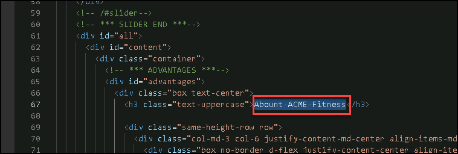
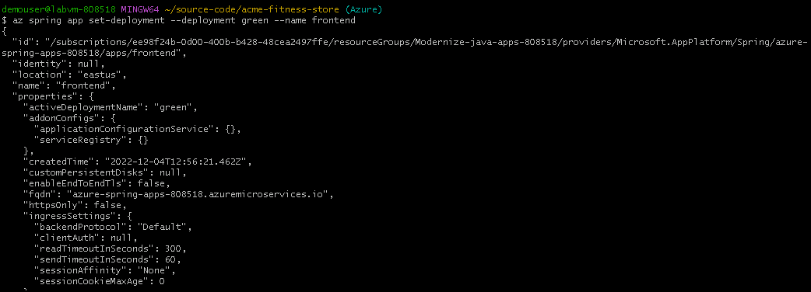

# Lab 6: Change the application code and update the app

  In this exercise, you will be updating the source code of the application and will update the spring application.
  
1. Navigate back to cmd and run the below command to open the index file where you will be making the code changes. 

   ```bash
   
   code ~/source-code/acme-fitness-store/apps/acme-shopping/public/index.html
   cd ~/source-code/acme-fitness-store
   ```

1. The index.html file will open with VS code editor, now in the line no **67**, update the value from **Abount ACME Fitness** to **ACME Fitness key Points** and save the file using **CTRL + S**

     

     

1. Once the changes are done, now you will be publishing a new stagging deployment to the frontend application.

1. Run the below command in the cmd to create a new deployment name as stagging-update for the frontend application.

    ```bash
    az spring app deployment create --name green --app ${FRONTEND_APP} --source-path ./apps/acme-shopping 
    ```
      
1.  Once the creation of the new deployment is completed, browse the newly created deployment from the below URL endpoint and observe the changes. Please make sure to update the SUFFIX in the URL.

    ```
    https://azure-spring-apps-SUFFIX.test.azuremicroservices.io/frontend/green/
    ```
    
    
    
1. Now, we will be moving the **green** deployment to the production so that we can see the changes from the production URL.

1. To set up the deployment to production, run the below command:

    ```bash
    az spring app set-deployment --deployment green --name ${FRONTEND_APP}
    ```
    
    
    
1. Once the set deployment is completed, refresh the main application gateway URL and you should be able to see the changes in production. If you do not have the application open, run the below command to get the gateway endpoint.

    ```bash
    echo "https://${GATEWAY_URL}"
    ```
     
    
Now, click on Next in the lab guide section in the bottom right corner to jump to the next exercise instructions.
