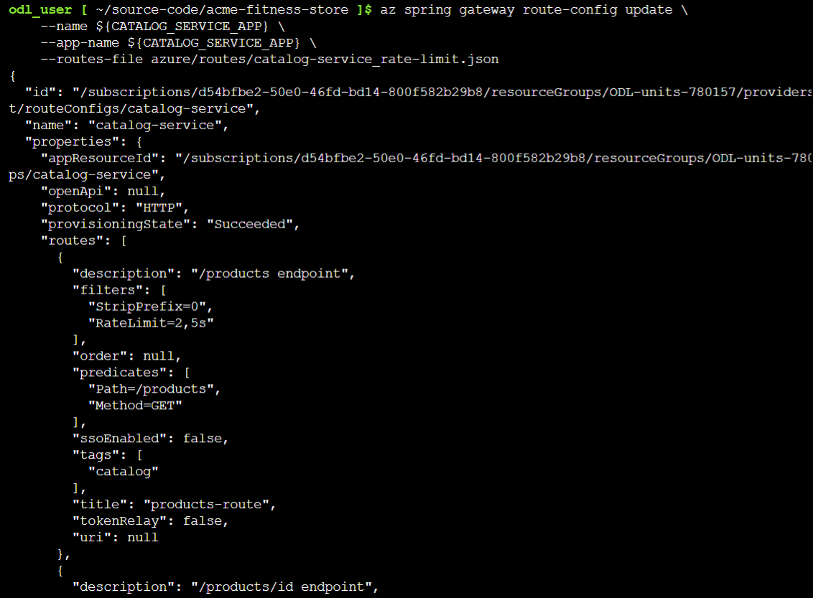

## Lab 7:  Set Request Rate Limits
Duration: 15 Minutes

In this lab, you will use Spring Cloud Gateway filters to apply rate limiting to your API.

### Task 1: Spring Cloud Gateway Rate Limit Filter (Read-only)

Spring Cloud Gateway includes route filters from the Open Source version as well as several additional route filters. One of these additional filters is the [RateLimit: Limiting user requests filter](https://docs.vmware.com/en/VMware-Spring-Cloud-Gateway-for-Kubernetes/1.1/scg-k8s/GUID-route-filters.html#ratelimit-limiting-user-requests-filter). The RateLimit filter limits the number of requests allowed per route during a time window.

   When defining a Route, you can add the RateLimit filter by including it in the list of filters for the route. The filter accepts 4 options:

   * Number of requests accepted during the window.
   * Duration of the window: by default milliseconds, but you can use the s, m, or h suffix to specify it in seconds, minutes, or hours.
   * (Optional) User partition key: it's also possible to apply rate limiting per user, that is, different users can have their throughput allowed based on an identifier found in the request. Set whether the key is in a JWT claim or HTTP header with '' or '' syntax.
   * (Optional) It is possible to rate limit by IP addresses. Note, this cannot be combined with the rate-limiting per user.

   > **Note:** The following example would limit all users to two requests every 5 seconds to the `/products` route, run the following command in the bash shell pane.

   ```json
   {
      "predicates": [
         "Path=/products",
         "Method=GET"
      ],
      "filters": [
         "StripPrefix=0",
         "RateLimit=2,5s"
      ]
   }
   ```

When the limit is exceeded, the response will fail with `429 Too Many Requests` status.

### Task 2: Update Spring Cloud Gateway Routes

1. To apply the `RateLimit` filter to the `/products` route run the following command:

   ```bash
   az spring gateway route-config update \
      --name ${CATALOG_SERVICE_APP} \
      --app-name ${CATALOG_SERVICE_APP} \
      --routes-file azure/routes/catalog-service_rate-limit.json
   ```

   
   
   
   > **Note:** If you are using a new Git Bash window, run `cd source-code/acme-fitness-store` command and ensure your Azure CLI is logged into your Azure subscription by running `az login` command.

### Task 3: Verify Request Rate Limits

1. To retrieve the URL for the `/products` route in Spring Cloud Gateway using the following command:

   ```bash
   GATEWAY_URL=$(az spring gateway show | jq -r '.properties.url')
   echo "https://${GATEWAY_URL}/products"
   ```

   Make several requests to the URL for `/products` within a five-second period to see requests fail with the status `429 Too Many Requests`.


Now, click on **Next** in the lab guide section in the bottom right corner to jump to the next exercise instructions.
