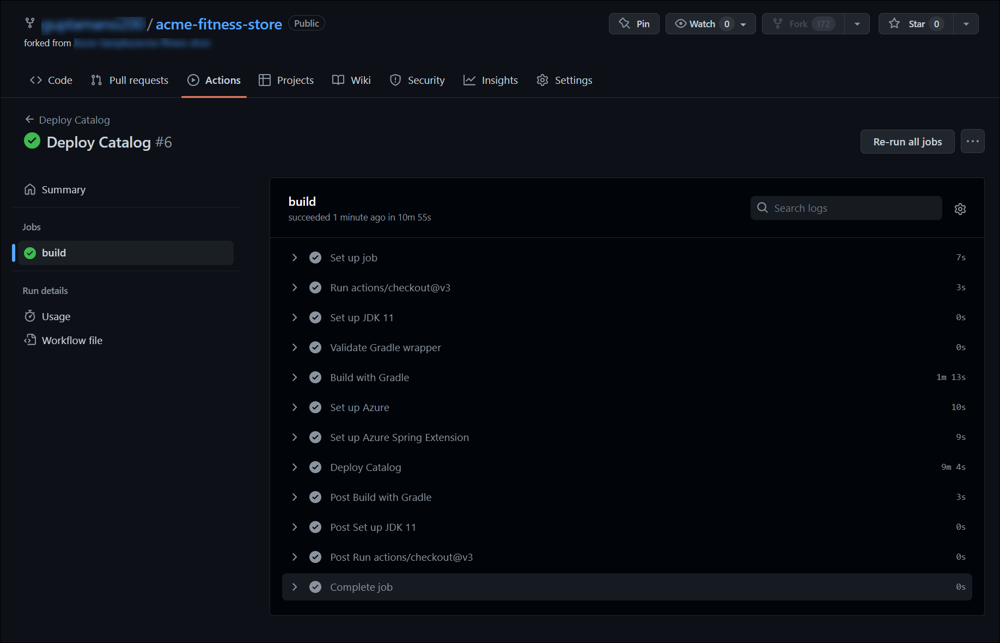

## Lab 7: Automate from idea to production

### Task 1: Setup Github Account and Settings

1. From the new browser tab, go to [Github](https://github.com/) and log in to your account.
    > Note: If you don't have an account for Github, please sign up.

1. After the login, go to [https://github.com/CloudLabsAI-Azure/acme-fitness-store](https://github.com/CloudLabsAI-Azure/acme-fitness-store) and click on `Fork`.

   
   
1. On the Create a new fork page, click on Create fork.   

### Task 2: Add Secrets to GitHub Actions

1. Now you're going to add the secrets to your repo.
     
   - The URL of your repo will look like this

     ```text
     https://github.com/{YOURACCOUNT}}/acme-fitness-store
     ```
1. From your repo, click on **Settings**.

1. Find **Secrets** (1) under _Security_ on the left side of menu, and click on **Actions** (2). After that Click on **New repository secret** (3).

   
   
1. Type `AZURE_CREDENTIALS` (1) for the name of the secret go to **Service Principal Details** and copy the secret key and **paste** (2) and then click on **Add Secret** (3).   

   

1. In a similar way, you will add the following secrets to GitHub Actions:

  
   * `APP_SERVICE` - Use your Spring app name.
   * `RESOURCE_GROUP` - with the value of your resource group that you are using for this lab.
   * `KEYVAULT` - with the value for your keyvault deployed in your environment.
   * `AZURE_LOCATION` - this is the Azure Region your resources will be created in.
   * `OIDC_JWK_SET_URI` - use the `JWK_SET_URI` defined in [Lab 2]
   * `OIDC_CLIENT_ID` - use the `CLIENT_ID` defined in [Lab 2]
   * `OIDC_CLIENT_SECRET` - use the `CLIENT_SECRET` defined in [Lab 2]
   * `OIDC_ISSUER_URI` - use the `ISSUER_URI` defined in [Lab 2]

    

1. Add the secret `TF_BACKEND_CONFIG` to GitHub Actions with the value (replacing `${STORAGE_ACCOUNT_NAME}` and `${STORAGE_RESOURCE_GROUP}`):

   ```text
   resource_group_name  = "${STORAGE_RESOURCE_GROUP}"
   storage_account_name = "${STORAGE_ACCOUNT_NAME}"
   container_name       = "terraform-state-container"
   key                  = "dev.terraform.tfstate"
   ```

### Task 3: Run GitHub Actions

1. From your repo, click on **Actions**.

1. Select **Deploy catalog** (1) under __Actions_ All worklows_ from the left side panel, and click on **Run workflow** (2). After that Click on **Run workflow** (3) under _Branch:Azure_.

   

1. Each application has a `Deploy` workflow that will redeploy the application when changes are made to that application. An example output from the catalog service is seen below:

   

1. Once the GitHub workflow is completed, navigate back to your web app and you should be able to see the new **Catalog** option added on the website.


## Lab Ends
