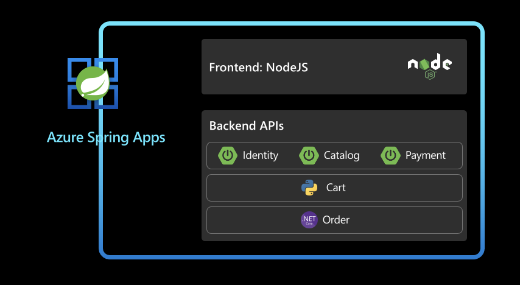

In the previous section we deployed a simple hello-world service to asa-e instance. In this section we are going to deploy the more sophisticated acme-fitness application to the same asa-e instance. 

This diagram below shows the final result once this section is complete:


Below are the diffrent steps that we configure/create to successfully deploy the services/apps
- [1. Create applications in Azure Spring Apps](#1-create-applications-in-azure-spring-apps)
- [2. Create Application Configuration Service](#2-create-application-configuration-service)
  - [2.1. Bind to Application Configuration Service](#21-bind-to-application-configuration-service)
- [3. Bind to Service Registry](#3-bind-to-service-registry)
- [4. Configure Tanzu Build Service](#4-configure-tanzu-build-service)
- [5. Build and Deploy Polyglot Applications](#5-build-and-deploy-polyglot-applications)

## 1. Create applications in Azure Spring Apps

First step is to create an application for each service:

```shell
az spring app create --name ${CART_SERVICE_APP} --instance-count 1 --memory 1Gi
az spring app create --name ${ORDER_SERVICE_APP} --instance-count 1 --memory 1Gi
az spring app create --name ${PAYMENT_SERVICE_APP} --instance-count 1 --memory 1Gi
az spring app create --name ${CATALOG_SERVICE_APP} --instance-count 1 --memory 1Gi
az spring app create --name ${FRONTEND_APP} --instance-count 1 --memory 1Gi
```

Next step is to provide config information for Payment Service and Catalog Service. Remaining services do not need config data stored separately. 
## 2. Create Application Configuration Service

Before we can go ahead and point the services to config stored in an external location, we first need to create an application config instance pointing to that external repo. In this case we are going to create an application config instance that points to a github repo using azure cli.

```shell
az spring application-configuration-service git repo add --name acme-fitness-store-config \
    --label main \
    --patterns "catalog/default,catalog/key-vault,identity/default,identity/key-vault,payment/default" \
    --uri "https://github.com/Azure-Samples/acme-fitness-store-config"
```

### 2.1. Bind to Application Configuration Service

Now the next step is to bind the above created application configuration service instance to the azure apps that use this external config. Here we bin


```shell
az spring application-configuration-service bind --app ${PAYMENT_SERVICE_APP} &
az spring application-configuration-service bind --app ${CATALOG_SERVICE_APP} &
wait
```

## 3. Bind to Service Registry

Applications need to communicate with each other. As we learnt in [previous section](../07-asa-e-components-overview/service-registry/README.md) ASA-E internally uses Tanzu Service Registry for dynamic service discovery. To achieve this, required services/apps need to be bound to the service registry using the commands below: 

```shell
az spring service-registry bind --app ${PAYMENT_SERVICE_APP}
az spring service-registry bind --app ${CATALOG_SERVICE_APP}
```

## 4. Configure Tanzu Build Service

As discussed in previous section [Tanzu Build Service](../07-asa-e-components-overview/tanzu-build-service/README.md) provides the feature to create OCI Images from source code. ASA-E comes with a default builder for Spring Boot application. For other languages that do not have default support, we need to create a custom builder using the command below: 

```shell
az spring build-service builder create -n ${CUSTOM_BUILDER} \
    --builder-file ./08-hol-2-deploy-acme-fitness/buildpacks/builder.json \
    --no-wait
```

## 5. Build and Deploy Polyglot Applications

Now that all the required services are configured, the next step is to go ahead and deploy the services/apps. For this we need access to the source code for the services. 

Now go ahead and create the apps.

```shell
# Deploy Payment Service
az spring app deploy --name ${PAYMENT_SERVICE_APP} \
    --config-file-pattern payment/default \
    --source-path ./apps/acme-payment 

# Deploy Catalog Service
az spring app deploy --name ${CATALOG_SERVICE_APP} \
    --config-file-pattern catalog/default \
    --source-path ./apps/acme-catalog 

# Deploy Order Service
az spring app deploy --name ${ORDER_SERVICE_APP} \
    --builder ${CUSTOM_BUILDER} \
    --source-path ./apps/acme-order 

# Deploy Cart Service 
az spring app deploy --name ${CART_SERVICE_APP} \
    --builder ${CUSTOM_BUILDER} \
    --env "CART_PORT=8080" \
    --source-path ./apps/acme-cart 

# Deploy Frontend App
az spring app deploy --name ${FRONTEND_APP} \
    --builder ${CUSTOM_BUILDER} \
    --source-path ./apps/acme-shopping 
```

You will notice that we need to supply a custom builder for frontend, cart service and order service as these are not Java based apps. Also to note is config-file-pattern for payment and catalog services. As you might recall in previous step, we configured aplication config service for payment and catalog services. This argument is providing the file pattern. More details about this pattern can be found in the previous section [application configuration sevice](../07-asa-e-components-overview/application-config-service/README.md)

After completing the above steps all the required applications should be successfully deployed. You can check for the status of these apps using the command below:

So far in this section we were able to successfully create and deploy the apps into an existing azure spring apps instance. 


⬅️ Previous guide: [07 - ASA-E components Overview](../07-asa-e-components-overview/README.md)

➡️ Next guide: [09 - Hands On Lab 3 - Spring Cloud Gateway Configuration](../09-hol-3-configure-spring-cloud-gateway/README.md)