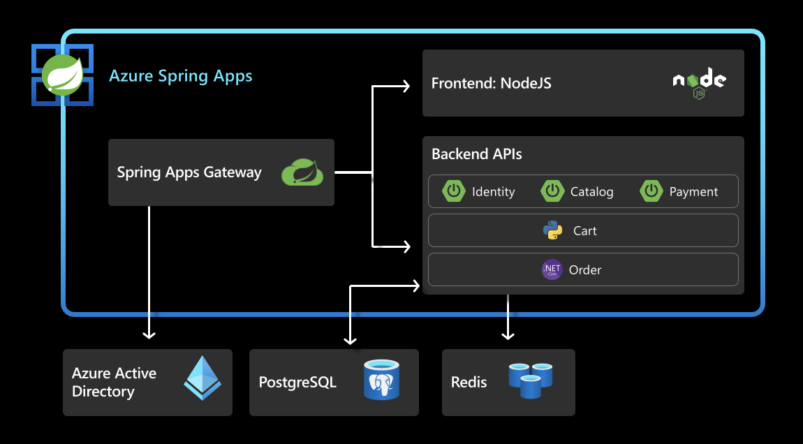

By default, several services use in-memory data storage. This unit will create persistent stores outside the applications and connect applications to those stores.

Once this section is complete, the architecture looks as below:
 

## 1. Prepare your environment

Create a bash script with environment variables by making a copy of the supplied template:

```shell
cp ./scripts/setup-db-env-variables-template.sh ./scripts/setup-db-env-variables.sh
```

Open `./scripts/setup-db-env-variables.sh` and enter the following information:

```shell
export AZURE_CACHE_NAME=acme-fitness-cache-CHANGE-ME                 #Unique name for Azure Cache for Redis Instance. Replace CHANGE_ME with the 4 unique characters that were created as part of ARM template in Section 3. [workshop-environment-setup](../03-workshop-environment-setup/README.md)
export POSTGRES_SERVER=acme-fitness-db-CHANGE-ME                 # Unique name for Azure Database for PostgreSQL Flexible Server. Replace CHANGE_ME with the 4 unique characters that were created as part of ARM template in Section 3.
```

Then, set the environment:

```shell
source ./scripts/setup-db-env-variables.sh
```


### 1.1. Allow connections from other Azure Services
```shell
az postgres flexible-server firewall-rule create --rule-name allAzureIPs \
     --name ${POSTGRES_SERVER} \
     --resource-group ${RESOURCE_GROUP} \
     --start-ip-address 0.0.0.0 --end-ip-address 0.0.0.0
     
### Enable the uuid-ossp extension
az postgres flexible-server parameter set \
    --resource-group ${RESOURCE_GROUP} \
    --server-name ${POSTGRES_SERVER} \
    --name azure.extensions --value uuid-ossp
```

## 2. Create a database for the services:

```shell
az postgres flexible-server db create \
  --database-name ${ORDER_SERVICE_DB} \
  --server-name ${POSTGRES_SERVER}
```

Create a database for the catalog service:

```shell
az postgres flexible-server db create \
  --database-name ${CATALOG_SERVICE_DB} \
  --server-name ${POSTGRES_SERVER}
```

> Note: wait for all services to be ready before continuing

## 3. Create Service Connectors

The Order Service and Catalog Service use Azure Database for Postgres, create Service Connectors for those applications:

```shell
# Bind order service to Postgres
az spring connection create postgres-flexible \
    --resource-group ${RESOURCE_GROUP} \
    --service ${SPRING_APPS_SERVICE} \
    --connection ${ORDER_SERVICE_DB_CONNECTION} \
    --app ${ORDER_SERVICE_APP} \
    --deployment default \
    --tg ${RESOURCE_GROUP} \
    --server ${POSTGRES_SERVER} \
    --database ${ORDER_SERVICE_DB} \
    --secret name=${POSTGRES_SERVER_USER} secret=${POSTGRES_SERVER_PASSWORD} \
    --client-type dotnet
    

# Bind catalog service to Postgres
az spring connection create postgres-flexible \
    --resource-group ${RESOURCE_GROUP} \
    --service ${SPRING_APPS_SERVICE} \
    --connection ${CATALOG_SERVICE_DB_CONNECTION} \
    --app ${CATALOG_SERVICE_APP} \
    --deployment default \
    --tg ${RESOURCE_GROUP} \
    --server ${POSTGRES_SERVER} \
    --database ${CATALOG_SERVICE_DB} \
    --secret name=${POSTGRES_SERVER_USER} secret=${POSTGRES_SERVER_PASSWORD} \
    --client-type springboot
```

The Cart Service requires a connection to Azure Cache for Redis, create the Service Connector:

```shell
az spring connection create redis \
    --resource-group ${RESOURCE_GROUP} \
    --service ${SPRING_APPS_SERVICE} \
    --connection $CART_SERVICE_CACHE_CONNECTION \
    --app ${CART_SERVICE_APP} \
    --deployment default \
    --tg ${RESOURCE_GROUP} \
    --server ${AZURE_CACHE_NAME} \
    --database 0 \
    --client-type java 
```

> Note: Currently, the Azure Spring Apps CLI extension only allows for client types of java, springboot, or dotnet.
> The cart service uses a client connection type of java because the connection strings are the same for python and java.
> This will be changed when additional options become available in the CLI.

## 4. Update Applications

Next, update the affected applications to use the newly created databases and redis cache.

Restart the Catalog Service for the Service Connector to take effect:
```shell
az spring app restart --name ${CATALOG_SERVICE_APP}
```

Retrieve the PostgreSQL connection string and update the Order Service:
```shell
POSTGRES_CONNECTION_STR=$(az spring connection show \
    --resource-group ${RESOURCE_GROUP} \
    --service ${SPRING_APPS_SERVICE} \
    --deployment default \
    --connection ${ORDER_SERVICE_DB_CONNECTION} \
    --app ${ORDER_SERVICE_APP} | jq '.configurations[0].value' -r)

az spring app update \
    --name order-service \
    --env "DatabaseProvider=Postgres" "ConnectionStrings__OrderContext=${POSTGRES_CONNECTION_STR}" "AcmeServiceSettings__AuthUrl=https://${GATEWAY_URL}"
```

Retrieve the Redis connection string and update the Cart Service:
```shell
REDIS_CONN_STR=$(az spring connection show \
    --resource-group ${RESOURCE_GROUP} \
    --service ${SPRING_APPS_SERVICE} \
    --deployment default \
    --app ${CART_SERVICE_APP} \
    --connection ${CART_SERVICE_CACHE_CONNECTION} | jq -r '.configurations[0].value')

az spring app update \
    --name cart-service \
    --env "CART_PORT=8080" "REDIS_CONNECTIONSTRING=${REDIS_CONN_STR}" "AUTH_URL=https://${GATEWAY_URL}"
```

## 5. View Persisted Data

Verify order data is now persisted in a PostgreSQL Database by placing an order. View your placed orders with the following URL:

```text
https://${GATEWAY_URL}/order/${USER_ID}
```

Your USER_ID is your username URL encoded.

Now restart the order service application:

```shell
az spring app restart --name ${ORDER_SERVICE_APP}
```

After restarting, revisit the URL for your placed orders and notice that they persisted. 


⬅️ Previous guide: [10 - Hands On Lab 4 - Configure Single Sign On](../10-hol-4-configure-single-signon/README.md)

➡️ Next guide: [12 - Secrets Handling with Azure Key Vault](../12-hol-6-secrets-handling-with-azure-keyvault/README.md)